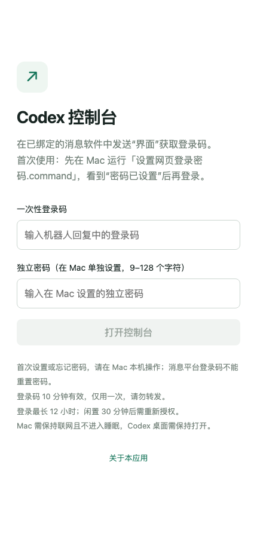
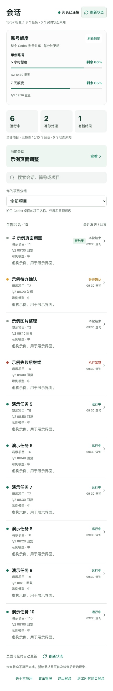
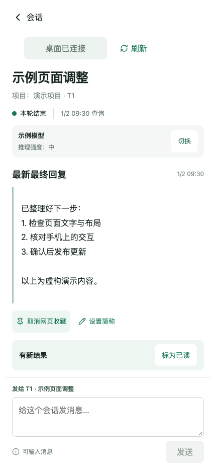
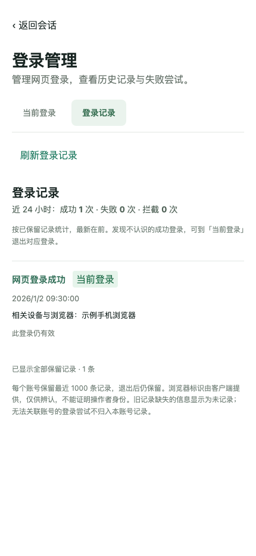

# 使用说明

[返回首页](README.md) · [还没安装？先看安装说明](INSTALL.md)

本页适用于已经完成部署的用户。使用时请保持 Mac 联网、唤醒，Codex 桌面客户端保持打开。

**本页截图来自独立演示环境：登录输入为空，会话、项目、回复、额度与登录记录均为虚构示例，不包含真实用户数据。截图中的数字不代表你的实际状态。**

## 1. 登录手机网页

1. 在已经绑定的消息软件私聊中发送 `界面`。
2. 打开回复中的控制台 HTTPS 地址。
3. 输入新的登录码和你在 Mac 设置的独立网页密码，点击“打开控制台”。

登录码 10 分钟有效，只能使用一次。网页密码不是服务器密码或消息平台密码。首次设置密码与账号绑定见 [安装说明](INSTALL.md#第二步选择平台并绑定自己)。

*图 1：空白登录页面。截图未填写登录码或密码。*

## 2. 看进度和找会话

进入首页后，先看顶部三类状态：

- **运行中**：任务正在执行。
- **等你处理**：任务需要你处理；具体确认内容到 Codex 桌面查看。
- **有新结果**：有新回复可查看，不等于你已经验收完成。

会话按最近一次发送消息或最终回复的时间排列；只刷新状态不会把旧会话移到前面。首页的“刷新状态”会检查当前列表前 8 个任务，显示检查进度、查询时间及未取得状态的数量，不会自动打开或发送消息。

点击状态卡可以筛选会话。通过搜索框查找任务名称、网页简称或项目；也可以用项目下拉框筛选。首页“账号额度”展示整个 Codex 账号的额度，并非某个会话独享。

*图 2：首页演示。项目、任务、状态和额度均为虚构数据。*

## 3. 打开并继续一个会话

1. 在列表中点开需要的任务。
2. 先看“最新最终回复”，了解最近一轮完成了什么。
3. 需要继续工作时，点击顶部“连接桌面会话”。
4. 等到显示“桌面已连接”、状态允许发送，再输入文字并点击“发送”。

已确认结束的失败轮次会显示“上轮失败，可继续”，可手动输入新消息继续；不会自动重发旧消息。待确认事项仍需在桌面处理，模型设置要恢复空闲后才能切换。

只查看已保存历史时，不必先连接桌面。连接异常或任务仍在运行时，发送按钮可能不可用；根据页面提示处理后刷新。

*图 3：虚构的“示例待办清单”会话，展示连接后的页面；未向真实 Codex 任务发送消息。*

## 4. 查看完整对话、结果和文件

会话页优先展示最终回复。下面的内容默认折叠，可以点击展开：

- **对话时间线**：查看上下文；较新的轮次在前，每轮内部按发生顺序排列。
- **执行记录与反馈**：查看执行过程，位于对应轮次中。
- **成果文件**：查看或下载该任务已登记的产出。没有收录的文件，请到桌面查看。
- **消息送达记录**：核对已发送消息的状态。

回复中明确嵌入的本地图片可在任务范围内收录并预览，点击可看大图；加载失败可点击“重试图片”。成果区支持“刷新成果”，下载仍是收录时的文件版本。

返回列表、重新打开会话或刷新页面时，当前登录会话会保留本标签页的草稿、阅读位置和展开状态；退出登录会清理这些状态。滚动较长页面后，可用“顶部”按钮返回开头。

如果长消息显示“展开完整内容”，点击即可继续阅读。成果入口只展示该任务明确产出的文件，不是整个电脑的文件浏览器。

## 5. 设置模型、简称和收藏

- **切换模型与推理强度**：先连接空闲会话，点击模型旁的“切换”，选择后点击“保存本会话设置”。只影响这个会话的下一轮，运行中请等本轮结束。
- **设置简称**：点击“设置简称”，输入方便辨认的名字。留空保存可恢复原名。
- **收藏标记**：点击“网页收藏”为常用会话加标记；再次点击可取消。当前首页按发送／回复时间排序，标记不会覆盖这个时间顺序。
- **标记已读**：看完新结果后，可点击“标为已读”。

网页简称和收藏标记用于网页管理；项目分组沿用桌面项目名称与归属。

## 6. 用消息软件控制会话

| 发送内容 | 用途 |
| --- | --- |
| `菜单` | 查看可用操作 |
| `对话` | 查看会话列表和编号 |
| `对话 关键词` | 搜索会话 |
| `切换 9` | 切换到编号 9 的会话；请换成列表里的实际编号 |
| 直接发送文字 | 切换成功后，把文字发给当前会话 |
| `进度` | 查看当前任务进展 |
| `结果` | 查看当前任务回复 |
| `界面` | 获取网页登录码和地址 |
| `退出` | 退出消息入口当前选择的桌面会话 |

例如：先发送 `对话`，再发送 `切换 9`，收到切换成功提示后，直接发送“继续完成刚才的修改”。

**网页选择的会话与消息软件选择的会话各自独立。** 网页里打开另一项任务，不会自动改变消息软件当前指向的会话。尚未切换到桌面任务时，直接输入文字会进入 cc-connect 默认助手。

## 7. 查看登录记录和退出设备

在会话列表底部点击“登录管理”：

- **当前登录**：查看仍有效的登录，点击“退出这次登录”可单独退出对应登录。
- **登录记录**：查看保留的成功、失败和拦截记录。发现不认识的成功登录，回到“当前登录”退出对应登录；必要时退出所有网页登录并在 Mac 重设密码。

*图 4：登录记录演示。设备名称、事件与时间均为虚构数据，没有真实地址或登录历史。*

浏览器名称仅供辨认，不能单独证明操作者身份。退出网页登录不会中断桌面已经执行的任务。网页登录闲置 30 分钟或达到最长 12 小时后，需要重新登录。

## 常见问题

| 现象 | 怎么处理 |
| --- | --- |
| 登录码过期或已用过 | 回到已绑定的私聊重新发送 `界面`，使用新码 |
| 网页密码不正确或忘记密码 | 确认输入的是独立网页密码；仍无法登录时，按 [密码重设](INSTALL.md#忘记网页密码)在 Mac 处理 |
| 手机打不开页面 | 确认 Mac 联网且未休眠；部署连接问题见 [安装排查](INSTALL.md#故障排查) |
| 会话一直加载或不能发送 | 保持 Codex 桌面打开，连接会话并刷新；运行中先等本轮结束 |
| 显示“等你处理” | 到 Codex 桌面查看并处理具体确认内容 |
| 发送后显示“结果待核对” | 先检查对话和消息送达记录，避免重复发送；核对后再按页面提示开始新消息 |
| 手机上切换了任务，机器人仍指向旧任务 | 两边选择各自独立；在消息软件中发送 `切换 编号` |
| 文件没有出现在成果入口 | 该文件可能未被收录，到 Codex 桌面查看原任务产出 |

安装、启动、常驻、恢复密码与网络命令统一放在 [安装说明](INSTALL.md)。本页只介绍日常操作。
